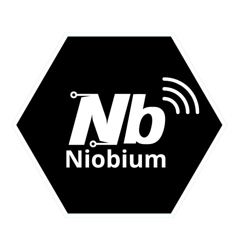

# Niobium Plugin
**Niobium** is a plugin developed for Obsidian that simplifies file synchronization between different vaults (note repositories). The plugin allows you to transfer, rename, and manage files, providing an easy-to-use interface for choosing which files to keep and which to delete during the synchronization process.

## Features
- File synchronization between different vaults.
- Automatic renaming of old files.
- Custom selection of altered files and files for deletion.
- User-friendly modal interface for file selection.
- ~~Detection of active servers for synchronization.~~

## Installation

### Prerequisites
- Obsidian installed.
- Node.js version 14 or higher.

### Installation Instructions

1. Clone the repository:

```bash
git clone https://github.com/Citeli-py/Niobium.git
```

2. Navigate to the plugin directory:

```bash
cd niobium-plugin
```

3. Install the dependencies:

```bash
npm install
```
4. Build the project:

```bash
npm run build
```

5. Copy the compiled plugin to your Obsidian vault:

```bash
cp -r ./dist /path/to/your/vault/.obsidian/plugins/niobium
```


## Configuration
In Obsidian, you can configure the server address (IP and port) for synchronization and select the vaults you want to monitor.

## Contributions
Contributions are welcome! 

### To contribute:

1. Fork the project.

2. Create a branch for your feature or fix:

```bash
git checkout -b my-feature
```
3. Commit your changes:

```bash
git commit -am 'Add new feature'
```
4. Push to the repository:

```bash
git push origin my-feature
```

5. Open a Pull Request.

## License
This project is licensed under the GPL-3.0 License. See the LICENSE file for details.